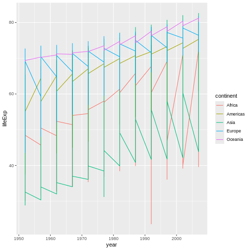

::::::::::::::::::::::::::::::::::::::: objectives

- ggplot2 を使用して出版品質のグラフィックを作成できるようになる。
- ggplot のプロットに幾何学（geometry）、美的要素（aesthetic）、統計レイヤー（statistics layers）を適用する。
- 異なる色、形状、線を使用してプロットの美的要素を操作する。
- スケールを変換したり、グループごとにパネル分けすることでデータ可視化を改善する。
- ggplot を使用して作成したプロットをディスクに保存する。

::::::::::::::::::::::::::::::::::::::::::::::::::

:::::::::::::::::::::::::::::::::::::::: questions

- R で出版品質のグラフィックを作成するにはどうすればよいですか？

::::::::::::::::::::::::::::::::::::::::::::::::::


データをプロットすることは、データや変数間の関係を素早く探る最良の方法の一つです。

R には 3 つの主なプロットシステムがあります。
[基本プロットシステム][base]、[lattice] パッケージ、そして [ggplot2] パッケージです。

今回は ggplot2 パッケージを学びます。ggplot2 は、出版品質のグラフィックを作成するために最も効果的です。

ggplot2 は "グラフィックの文法 (grammar of graphics)" に基づいています。この概念は、任意のプロットが次のような同じ構成要素のセットから構築できるというものです：**データセット**、**美的要素のマッピング**、およびグラフィックの**レイヤー**。

- **データセット**は、ユーザーが提供するデータです。

- **美的要素のマッピング (Mapping aesthetics)** は、データをグラフィックに結びつけます。
  これにより、X軸やY軸に何をプロットするか、データポイントのサイズや色をどうするかなど、グラフの見た目にデータを反映させます。

- **レイヤー**は、ggplot2 の実際のグラフィック出力です。
  レイヤーはプロットの種類（散布図、ヒストグラムなど）、座標系（長方形、極座標など）、およびその他の重要なプロットの側面を決定します。
  このようなグラフィックのレイヤーの概念は、Photoshop、Illustrator、Inkscape などの画像編集プログラムを使用した経験があれば馴染みがあるかもしれません。

では、以前使用した gapminder データを使って例を構築してみましょう。
最も基本的な関数は `ggplot` で、これにより新しいプロットを作成していることを R に知らせます。
`ggplot` 関数に渡した引数は、プロット全体に適用される「グローバル」オプションです。


``` r
library("ggplot2")
ggplot(data = gapminder)
```


ここでは `ggplot` を呼び出し、プロットに表示するデータを指定しました。
これはプロットを実際に描画するのに十分な情報ではなく、他の要素を追加するための白紙の状態を作成するだけです。

次に、`aes` 関数を使用して**美的要素のマッピング**を追加します。
`aes` は、**データ**内の変数が図の美的プロパティ（例：X軸やY軸の位置）にどのようにマップされるかを `ggplot` に伝えます。


``` r
ggplot(data = gapminder, mapping = aes(x = gdpPercap, y = lifeExp))
```


ここでは、gapminder データフレームの "gdpPercap" 列を X 軸に、"lifeExp" 列を Y 軸にプロットするよう `ggplot` に指示しました。
`aes` にこれらの列を明示的に渡す必要がないのは、`ggplot` が **data** から自動的に列を見つけるためです。

プロットを完成させる最後のステップは、**レイヤー**を追加してデータを視覚的に表現する方法を `ggplot` に指示することです。


``` r
ggplot(data = gapminder, mapping = aes(x = gdpPercap, y = lifeExp)) +
  geom_point()
```


ここでは `geom_point` を使用して、**X** と **Y** の関係を散布図として視覚的に表現するように指示しました。

:::::::::::::::::::::::::::::::::::::::  challenge

## チャレンジ 1

例を修正して、平均寿命が時間とともにどのように変化したかを示す図を作成してください：


``` r
ggplot(data = gapminder, mapping = aes(x = gdpPercap, y = lifeExp)) + geom_point()
```

ヒント：gapminder データセットには "year" という列があり、これを X 軸に表示する必要があります。

:::::::::::::::  solution

## チャレンジ 1 の解答

次のような解答例があります：


``` r
ggplot(data = gapminder, mapping = aes(x = year, y = lifeExp)) + geom_point()
```

<div class="figure" style="text-align: center">

<p class="caption">平均寿命が時間とともに増加していることを示す、年と平均寿命の散布図。</p>
</div>

:::::::::::::::::::::::::

::::::::::::::::::::::::::::::::::::::::::::::::::

## レイヤー (Layers)

散布図は、時間経過による変化を可視化するための最適な方法ではないかもしれません。
代わりに、データを折れ線グラフとして視覚化してみましょう：


``` r
ggplot(data = gapminder, mapping = aes(x=year, y=lifeExp, color=continent)) +
  geom_line()
```



`geom_point` レイヤーを追加する代わりに、`geom_line` レイヤーを追加しました。

...

:::::::::::::::::::::::::::::::::::::::::  callout

## ヒント: 美的要素に値を設定する

これまで、美的要素（例：**色**）をデータ内の変数にマッピングする方法を見てきました。
たとえば、`geom_line(mapping = aes(color=continent))` を使用すると、各大陸に異なる色が割り当てられます。
しかし、すべての線の色を青に変更したい場合はどうでしょう？
`geom_line(mapping = aes(color="blue"))` が機能すると考えるかもしれませんが、そうではありません。
特定の変数にマッピングしたくない場合は、`aes()` の外側で色を指定します：
`geom_line(color="blue")` のように記述します。

::::::::::::::::::::::::::::::::::::::::::::::::::

:::::::::::::::::::::::::::::::::::::::  challenge

## チャレンジ 3

前の例からポイントレイヤーとラインレイヤーの順序を入れ替えてみてください。何が起こるでしょうか？

:::::::::::::::  solution

## チャレンジ 3 の解答

ラインがポイントの上に描画されるようになります！


``` r
ggplot(data = gapminder, mapping = aes(x=year, y=lifeExp, group=country)) +
 geom_point() + geom_line(mapping = aes(color=continent))
```


:::::::::::::::::::::::::

::::::::::::::::::::::::::::::::::::::::::::::::::

## 変換と統計

ggplot2 を使用すると、データの上に統計モデルを簡単にオーバーレイできます。
例を示すために、最初の例に戻ります：


``` r
ggplot(data = gapminder, mapping = aes(x = gdpPercap, y = lifeExp)) +
  geom_point()
```


GDP の極端な値が原因で、ポイント間の関係を確認するのが難しいです。
X軸の単位スケールを変更するには *scale* 関数を使用します。これにより、データ値と美的要素の視覚値の間のマッピングが制御されます。
また、大量のクラスター化されたデータを扱う際に役立つ *alpha* 関数を使用してポイントの透過性を変更することもできます。


``` r
ggplot(data = gapminder, mapping = aes(x = gdpPercap, y = lifeExp)) +
  geom_point(alpha = 0.5) + scale_x_log10()
```

<div class="figure" style="text-align: center">

<p class="caption">X軸が対数スケールでデータが拡散したGDPと平均寿命の散布図</p>
</div>

`scale_x_log10` 関数はプロットの座標系に変換を適用します。
これにより、10 の倍数が左から右に均等に配置されます。たとえば、1,000 の GDP は 10,000 の値から 100,000 の値までと同じ水平距離を持つようになります。
これにより、X軸に沿ったデータの分布を視覚化しやすくなります。

:::::::::::::::::::::::::::::::::::::::::  callout

## ヒント：美的要素をマッピングではなく値に設定するリマインダー

`geom_point(alpha = 0.5)` を使用したことに注意してください。前回のヒントで述べたように、`aes()` 関数の外側で設定を行うと、この値がすべてのポイントに適用されます。
ただし、他の美的要素設定と同様に、*alpha* をデータ内の変数にマッピングすることも可能です。
たとえば、`geom_point(mapping = aes(alpha = continent))` を使用すると、大陸ごとに異なる透過性を指定できます。

::::::::::::::::::::::::::::::::::::::::::::::::::

データに簡単な関係を適合させるには、`geom_smooth` レイヤーを追加します：


``` r
ggplot(data = gapminder, mapping = aes(x = gdpPercap, y = lifeExp)) +
  geom_point(alpha = 0.5) + scale_x_log10() + geom_smooth(method="lm")
```

``` output
`geom_smooth()` using formula = 'y ~ x'
```


ラインを太くするには、`geom_smooth` レイヤー内で **linewidth** 美的要素を設定します：


``` r
ggplot(data = gapminder, mapping = aes(x = gdpPercap, y = lifeExp)) +
  geom_point(alpha = 0.5) + scale_x_log10() + geom_smooth(method="lm", linewidth=1.5)
```

``` output
`geom_smooth()` using formula = 'y ~ x'
```


美的要素を指定する方法には2つあります。ここでは、`geom_smooth` に引数として **linewidth** を渡して美的要素を設定し、`geom` 全体に適用しました。
以前のレッスンでは、データ変数とその視覚表現の間にマッピングを定義するために `aes` 関数を使用しました。

:::::::::::::::::::::::::::::::::::::::  challenge

## チャレンジ 4a

前の例のポイントレイヤーで、ポイントの色とサイズを変更してください。

ヒント：`aes` 関数を使用しないでください。

ヒント：ポイントに対する `linewidth` に相当するものは `size` です。

:::::::::::::::  solution

## チャレンジ 4a の解答

次のような解答例があります：
`color` 引数が `aes()` 関数の外側で指定されていることに注意してください。
これは、グラフ上のすべてのデータポイントに適用され、特定の変数に関連付けられていません。


``` r
ggplot(data = gapminder, mapping = aes(x = gdpPercap, y = lifeExp)) +
 geom_point(size=3, color="orange") + scale_x_log10() +
 geom_smooth(method="lm", linewidth=1.5)
```

``` output
`geom_smooth()` using formula = 'y ~ x'
```


:::::::::::::::::::::::::

::::::::::::::::::::::::::::::::::::::::::::::::::

:::::::::::::::::::::::::::::::::::::::  challenge

## チャレンジ 4b

チャレンジ 4a の解答を修正し、ポイントの形状を変更し、大陸ごとに異なる色と新しいトレンドラインを追加してください。
ヒント：`color` 引数は美的マッピング内で使用できます。

:::::::::::::::  solution

## チャレンジ 4b の解答

次のような解答例があります：
`color` 引数を `aes()` 関数内で指定することで、特定の変数に接続できます。
一方で、`shape` 引数は `aes()` 呼び出しの外側で指定されており、すべてのデータポイントを同じ形状に変更します。


``` r
ggplot(data = gapminder, mapping = aes(x = gdpPercap, y = lifeExp, color = continent)) +
 geom_point(size=3, shape=17) + scale_x_log10() +
 geom_smooth(method="lm", linewidth=1.5)
```

``` output
`geom_smooth()` using formula = 'y ~ x'
```


:::::::::::::::::::::::::

::::::::::::::::::::::::::::::::::::::::::::::::::

## マルチパネル図

以前、すべての国における時間経過による平均寿命の変化を1つのプロットで視覚化しました。
代わりに、**facet** パネルのレイヤーを追加して、複数のパネルに分割することもできます。

:::::::::::::::::::::::::::::::::::::::::  callout

## ヒント

アメリカ大陸にある国のみを含むデータのサブセットを作成します。
これには25カ国が含まれますが、これにより図が煩雑になり始めます。
X軸ラベルを回転させて読みやすさを維持するために「テーマ」定義を適用します。
ggplot2ではほぼすべてがカスタマイズ可能です。

::::::::::::::::::::::::::::::::::::::::::::::::::


``` r
americas <- gapminder[gapminder$continent == "Americas",]
ggplot(data = americas, mapping = aes(x = year, y = lifeExp)) +
  geom_line() +
  facet_wrap( ~ country) +
  theme(axis.text.x = element_text(angle = 45))
```


`facet_wrap` レイヤーには、チルダ（~）で表される「式」が引数として渡されます。
これにより、Rは gapminder データセットの country 列内のユニークな値ごとにパネルを描画します。

## テキストの変更

この図を出版用にクリーンアップするには、いくつかのテキスト要素を変更する必要があります。
X軸は煩雑すぎ、Y軸にはデータフレーム内の列名ではなく「Life expectancy」と記載する必要があります。

これを行うには、いくつかの異なるレイヤーを追加します。**テーマ (theme)** レイヤーは軸テキストや全体的なテキストサイズを制御します。
軸ラベル、プロットタイトル、および凡例のタイトルは `labs` 関数を使用して設定できます。
凡例タイトルは、`aes` 仕様で使用した名前を使って設定します。
以下では、色の凡例タイトルを `color = "Continent"` として設定しています。
同様に、塗りつぶしの凡例タイトルは `fill = "MyTitle"` として設定します。


``` r
ggplot(data = americas, mapping = aes(x = year, y = lifeExp, color=continent)) +
  geom_line() + facet_wrap( ~ country) +
  labs(
    x = "Year",              # X軸のタイトル
    y = "Life expectancy",   # Y軸のタイトル
    title = "Figure 1",      # 図のメインタイトル
    color = "Continent"      # 凡例のタイトル
  ) +
  theme(axis.text.x = element_text(angle = 90, hjust = 1))
```


## プロットのエクスポート

`ggsave()` 関数を使用すると、ggplot で作成したプロットをエクスポートできます。
`width`、`height`、および `dpi` 引数を調整することで、出版用の高品質グラフィックを作成できます。
上記のプロットを保存するには、まずそれを `lifeExp_plot` という変数に割り当て、その後 `ggsave` を使用してプロットを `png` 形式で `results` ディレクトリに保存します。
（作業ディレクトリ内に `results/` フォルダを作成してください。）


``` r
lifeExp_plot <- ggplot(data = americas, mapping = aes(x = year, y = lifeExp, color=continent)) +
  geom_line() + facet_wrap( ~ country) +
  labs(
    x = "Year",              # X軸のタイトル
    y = "Life expectancy",   # Y軸のタイトル
    title = "Figure 1",      # 図のメインタイトル
    color = "Continent"      # 凡例のタイトル
  ) +
  theme(axis.text.x = element_text(angle = 90, hjust = 1))

ggsave(filename = "results/lifeExp.png", plot = lifeExp_plot, width = 12, height = 10, dpi = 300, units = "cm")
```

`ggsave` の便利な点は2つあります。
1つ目は、最後に作成したプロットをデフォルトとして保存することです。そのため、`plot` 引数を省略すると、自動的に最後に作成したプロットが保存されます。
2つ目は、指定したファイル名の拡張子（例：`.png` や `.pdf`）から保存形式を自動的に判断することです。
必要に応じて、`device` 引数で形式を明示的に指定することもできます。

これは ggplot2 でできることの一部です。RStudio は利用可能なさまざまなレイヤーの概要を示した非常に便利な[チートシート][cheat]を提供しています。
また、[ggplot2 のウェブサイト][ggplot-doc] にはより詳細なドキュメントがあります。
すべての RStudio チートシートは[RStudio のウェブサイト][cheat_all]から利用できます。
最後に、変更方法がわからない場合、Google 検索を使用すると、Stack Overflow 上の関連する質問と再利用可能なコードが見つかることがよくあります。

:::::::::::::::::::::::::::::::::::::::  challenge

## チャレンジ 5

異なる大陸間で利用可能な年における平均寿命を比較するボックスプロットを生成してください。

応用：

- Y軸の名前を「Life Expectancy」に変更する。
- X軸のラベルを削除する。

:::::::::::::::  solution

## チャレンジ 5 の解答

次のような解答例があります：
`xlab()` および `ylab()` はそれぞれ X軸と Y軸のラベルを設定します。
軸タイトル、テキスト、目盛りは `theme()` 呼び出し内で変更する必要があります。


``` r
ggplot(data = gapminder, mapping = aes(x = continent, y = lifeExp, fill = continent)) +
 geom_boxplot() + facet_wrap(~year) +
 ylab("Life Expectancy") +
 theme(axis.title.x=element_blank(),
       axis.text.x = element_blank(),
       axis.ticks.x = element_blank())
```


:::::::::::::::::::::::::

::::::::::::::::::::::::::::::::::::::::::::::::::

[base]: https://www.statmethods.net/graphs/index.html
[lattice]: https://www.statmethods.net/advgraphs/trellis.html
[ggplot2]: https://www.statmethods.net/advgraphs/ggplot2.html
[cheat]: https://www.rstudio.org/links/data_visualization_cheat_sheet
[cheat_all]: https://www.rstudio.com/resources/cheatsheets/
[ggplot-doc]: https://ggplot2.tidyverse.org/reference/


:::::::::::::::::::::::::::::::::::::::: keypoints

- `ggplot2` を使用してプロットを作成する。
- グラフィックをレイヤーとして考える: 美的要素、幾何学、統計、スケール変換、グループ化。

::::::::::::::::::::::::::::::::::::::::::::::::::


