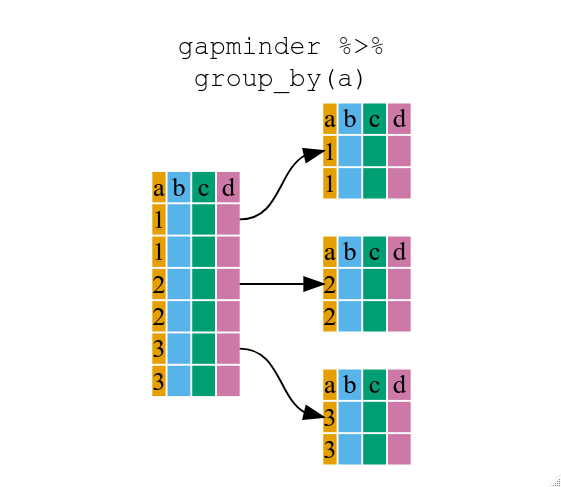

::::::::::::::::::::::::::::::::::::::: objectives

- `dplyr` の6つの主要なデータフレーム操作の「動詞」をパイプと共に使用できるようになる。
- `group_by()` と `summarize()` を組み合わせてデータセットを要約する方法を理解する。
- 論理フィルタリングを使用してデータのサブセットを分析できるようになる。

::::::::::::::::::::::::::::::::::::::::::::::::::

:::::::::::::::::::::::::::::::::::::::: questions

- 自分を繰り返さずにデータフレームを操作するにはどうすればよいですか？

::::::::::::::::::::::::::::::::::::::::::::::::::


データフレームの操作とは、研究者にとって多くの意味を持ちます。
たとえば、特定の観測値（行）や変数（列）を選択したり、データを特定の変数でグループ化したり、要約統計量を計算したりします。
これらの操作は通常の R の操作で実行できます：


``` r
mean(gapminder$gdpPercap[gapminder$continent == "Africa"])
```

``` output
[1] 2193.755
```

``` r
mean(gapminder$gdpPercap[gapminder$continent == "Americas"])
```

``` output
[1] 7136.11
```

``` r
mean(gapminder$gdpPercap[gapminder$continent == "Asia"])
```

``` output
[1] 7902.15
```

しかし、この方法はあまり「効率的」ではありません。
繰り返し作業は、現在および将来の時間を浪費し、重大なバグを引き起こす可能性があります。

## `dplyr` パッケージ

幸いなことに、[`dplyr`](https://cran.r-project.org/package=dplyr) パッケージは、上記の繰り返しを減らし、エラーの確率を減らし、入力作業を削減する非常に便利な関数を提供します。
さらに、`dplyr` の文法は読みやすくなる場合もあります。

:::::::::::::::::::::::::::::::::::::::::  callout

## ヒント：Tidyverse

`dplyr` パッケージは、データサイエンス用に設計された「Tidyverse」と呼ばれる一連の R パッケージの一部です。
これらのパッケージは、互いに調和して動作するように特別に設計されています。
このコースではいくつかのパッケージについて説明しますが、詳細は次のリンクを参照してください：
[https://www.tidyverse.org/](https://www.tidyverse.org/)

::::::::::::::::::::::::::::::::::::::::::::::::::

ここでは、最もよく使用される5つの関数と、パイプ (`%>%`) を使用した組み合わせを紹介します。

1. `select()`
2. `filter()`
3. `group_by()`
4. `summarize()`
5. `mutate()`

まだこのパッケージをインストールしていない場合は、以下を実行してください：


``` r
install.packages('dplyr')
```

次に、パッケージをロードします：


``` r
library("dplyr")
```

## `select()` の使用

たとえば、データフレームのいくつかの変数のみを使用したい場合は、`select()` 関数を使用できます。
これにより、選択した変数のみが保持されます。


``` r
year_country_gdp <- select(gapminder, year, country, gdpPercap)
```

{alt='データフレームの2つの列を選択する select 関数の使用を示す図'}

`gapminder` データから `continent` 列を削除したい場合は次のようにします：


``` r
smaller_gapminder_data <- select(gapminder, -continent)
```

`year_country_gdp` を開くと、年、国、および gdpPercap のみが含まれていることがわかります。
上記では通常の文法を使用しましたが、`dplyr` の強みはパイプを使用して複数の関数を組み合わせることにあります。
R では初めてのパイプ文法なので、上記の例をパイプを使って書き直してみます。


``` r
year_country_gdp <- gapminder %>% select(year, country, gdpPercap)
```

この書き方の理由を理解するために、ステップごとに説明します。
まず、gapminder データフレームを呼び出し、パイプ記号 `%>%` を使用して次のステップである `select()` 関数に渡します。
この場合、`select()` 関数でどのデータオブジェクトを使用するか指定しません。前のパイプからそれを取得するためです。
**豆知識**：シェルでパイプに出会ったことがある可能性があります。
R ではパイプ記号は `%>%` ですが、シェルでは `|` です。概念は同じです！

:::::::::::::::::::::::::::::::::::::::::  callout

## ヒント：dplyr を使った列名の変更

第4章では、`names()` 関数の出力に値を割り当てることで列名を変更する方法を学びました。
これは少し面倒ですが、幸いなことに dplyr には `rename()` 関数があります。

パイプライン内での構文は `rename(new_name = old_name)` です。
たとえば、上記の `select()` 文から gdpPercap 列名を変更してみましょう。


``` r
tidy_gdp <- year_country_gdp %>% rename(gdp_per_capita = gdpPercap)

head(tidy_gdp)
```

``` output
  year     country gdp_per_capita
1 1952 Afghanistan       779.4453
2 1957 Afghanistan       820.8530
3 1962 Afghanistan       853.1007
4 1967 Afghanistan       836.1971
5 1972 Afghanistan       739.9811
6 1977 Afghanistan       786.1134
```

::::::::::::::::::::::::::::::::::::::::::::::::::

## `filter()` の使用

上記を進めて、ヨーロッパの国のみを対象にしたい場合、`select` と `filter` を組み合わせることができます：


``` r
year_country_gdp_euro <- gapminder %>%
    filter(continent == "Europe") %>%
    select(year, country, gdpPercap)
```

2007年のヨーロッパの国の平均寿命だけを表示したい場合は次のようにします：


``` r
europe_lifeExp_2007 <- gapminder %>%
  filter(continent == "Europe", year == 2007) %>%
  select(country, lifeExp)
```

:::::::::::::::::::::::::::::::::::::::  challenge

## チャレンジ 1

パイプを含む複数行にわたる単一のコマンドを書いて、`lifeExp`、`country`、`year` のアフリカの値だけを含むデータフレームを生成してください。
他の大陸のデータは含まないようにしてください。
このデータフレームには何行ありますか？また、その理由は？

:::::::::::::::  solution

## チャレンジ 1 の解答


``` r
year_country_lifeExp_Africa <- gapminder %>%
                           filter(continent == "Africa") %>%
                           select(year, country, lifeExp)
```

:::::::::::::::::::::::::

::::::::::::::::::::::::::::::::::::::::::::::::::

上記と同様に、最初に gapminder データフレームを `filter()` 関数に渡し、その後 `filter()` でフィルタリングされたバージョンの gapminder データフレームを `select()` 関数に渡します。
**注意:** この場合、操作の順序が非常に重要です。
最初に `select` を使用した場合、フィルタリングステップの前に `continent` 変数を削除してしまうため、`filter` は動作しなくなります。

## `group_by()` の使用

ベース R を使ったエラーの起きやすい繰り返しを減らすつもりでしたが、これまではまだ同じことをすべての大陸について繰り返す必要がありました。
`filter()` を使用すると、条件に一致する観測値（上記では `continent=="Europe"`）のみが通過しますが、代わりに `group_by()` を使用すると、フィルタリングに使える一意の条件ごとにグループ化できます。


``` r
str(gapminder)
```

``` output
'data.frame':	1704 obs. of  6 variables:
 $ country  : chr  "Afghanistan" "Afghanistan" "Afghanistan" "Afghanistan" ...
 $ year     : int  1952 1957 1962 1967 1972 1977 1982 1987 1992 1997 ...
 $ pop      : num  8425333 9240934 10267083 11537966 13079460 ...
 $ continent: chr  "Asia" "Asia" "Asia" "Asia" ...
 $ lifeExp  : num  28.8 30.3 32 34 36.1 ...
 $ gdpPercap: num  779 821 853 836 740 ...
```

``` r
str(gapminder %>% group_by(continent))
```

``` output
gropd_df [1,704 × 6] (S3: grouped_df/tbl_df/tbl/data.frame)
 $ country  : chr [1:1704] "Afghanistan" "Afghanistan" "Afghanistan" "Afghanistan" ...
 $ year     : int [1:1704] 1952 1957 1962 1967 1972 1977 1982 1987 1992 1997 ...
 $ pop      : num [1:1704] 8425333 9240934 10267083 11537966 13079460 ...
 $ continent: chr [1:1704] "Asia" "Asia" "Asia" "Asia" ...
 $ lifeExp  : num [1:1704] 28.8 30.3 32 34 36.1 ...
 $ gdpPercap: num [1:1704] 779 821 853 836 740 ...
 - attr(*, "groups")= tibble [5 × 2] (S3: tbl_df/tbl/data.frame)
  ..$ continent: chr [1:5] "Africa" "Americas" "Asia" "Europe" ...
  ..$ .rows    : list<int> [1:5] 
  .. ..$ : int [1:624] 25 26 27 28 29 30 31 32 33 34 ...
  .. ..$ : int [1:300] 49 50 51 52 53 54 55 56 57 58 ...
  .. ..$ : int [1:396] 1 2 3 4 5 6 7 8 9 10 ...
  .. ..$ : int [1:360] 13 14 15 16 17 18 19 20 21 22 ...
  .. ..$ : int [1:24] 61 62 63 64 65 66 67 68 69 70 ...
  .. ..@ ptype: int(0) 
  ..- attr(*, ".drop")= logi TRUE
```

`group_by()` を使用したデータフレーム（`group

ed_df`）の構造は、元の `gapminder`（`data.frame`）とは異なることに気づくでしょう。
`grouped_df` は、各リスト項目が特定の `continent` の値に対応する行のみを含む `data.frame` で構成されたリストのように考えることができます。

{alt='group_by 関数がデータフレームをグループ化する仕組みを示す図'}
```

## `summarize()` の使用

上記では少し退屈でしたが、`group_by()` を `summarize()` と組み合わせると非常に強力になります。
これにより、各大陸ごとのデータフレームに対して繰り返し処理を行う関数を使用して、新しい変数を作成できます。
つまり、`group_by()` を使用して元のデータフレームを複数の部分に分割し、その後、`summarize()` 内で関数（例：`mean()` や `sd()`）を実行できます。


``` r
gdp_bycontinents <- gapminder %>%
    group_by(continent) %>%
    summarize(mean_gdpPercap = mean(gdpPercap))
```

{alt='group_by と summarize を組み合わせて新しい変数を作成する使用例'}


``` r
continent mean_gdpPercap
     <fctr>          <dbl>
1    Africa       2193.755
2  Americas       7136.110
3      Asia       7902.150
4    Europe      14469.476
5   Oceania      18621.609
```

これにより、大陸ごとの gdpPercap の平均値を計算できましたが、さらに便利なことに発展します。

:::::::::::::::::::::::::::::::::::::::  challenge

## チャレンジ 2

各国の平均寿命を計算してください。平均寿命が最も長い国と最も短い国はどこですか？

:::::::::::::::  solution

## チャレンジ 2 の解答


``` r
lifeExp_bycountry <- gapminder %>%
   group_by(country) %>%
   summarize(mean_lifeExp = mean(lifeExp))
lifeExp_bycountry %>%
   filter(mean_lifeExp == min(mean_lifeExp) | mean_lifeExp == max(mean_lifeExp))
```

``` output
# A tibble: 2 × 2
  country      mean_lifeExp
  <chr>               <dbl>
1 Iceland              76.5
2 Sierra Leone         36.8
```

別の方法として、`dplyr` の関数 `arrange()` を使用して行を並べ替えることもできます。
これはデータフレームの1つ以上の変数に基づいて並べ替えを行います。
降順にソートするには `arrange()` 内で `desc()` を使用します。


``` r
lifeExp_bycountry %>%
   arrange(mean_lifeExp) %>%
   head(1)
```

``` output
# A tibble: 1 × 2
  country      mean_lifeExp
  <chr>               <dbl>
1 Sierra Leone         36.8
```

``` r
lifeExp_bycountry %>%
   arrange(desc(mean_lifeExp)) %>%
   head(1)
```

``` output
# A tibble: 1 × 2
  country mean_lifeExp
  <chr>          <dbl>
1 Iceland         76.5
```

アルファベット順でも並べ替え可能です：


``` r
lifeExp_bycountry %>%
   arrange(desc(country)) %>%
   head(1)
```

``` output
# A tibble: 1 × 2
  country  mean_lifeExp
  <chr>           <dbl>
1 Zimbabwe         52.7
```

::::::::::::::::::::::::::::::::::::::::::::::::::

:::::::::::::::::::::::::

`group_by()` 関数を使用すると、複数の変数でグループ化できます。たとえば、`year` と `continent` でグループ化してみましょう。


``` r
gdp_bycontinents_byyear <- gapminder %>%
    group_by(continent, year) %>%
    summarize(mean_gdpPercap = mean(gdpPercap))
```

``` output
`summarise()` has grouped output by 'continent'. You can override using the
`.groups` argument.
```

これだけでもかなり強力ですが、さらに便利なことに、`summarize()` 内で複数の新しい変数を定義することもできます。


``` r
gdp_pop_bycontinents_byyear <- gapminder %>%
    group_by(continent, year) %>%
    summarize(mean_gdpPercap = mean(gdpPercap),
              sd_gdpPercap = sd(gdpPercap),
              mean_pop = mean(pop),
              sd_pop = sd(pop))
```

``` output
`summarise()` has grouped output by 'continent'. You can override using the
`.groups` argument.
```

## `count()` と `n()` の使用

グループごとの観測値の数を数える操作は非常に一般的です。`dplyr` パッケージにはこれを支援する2つの関連する関数があります。

たとえば、2002年のデータセットに含まれる国の数を確認したい場合、`count()` 関数を使用できます。
この関数は、グループ化したい列名を1つ以上指定し、`sort=TRUE` を追加することで結果を降順に並べることができます：


``` r
gapminder %>%
    filter(year == 2002) %>%
    count(continent, sort = TRUE)
```

``` output
  continent  n
1    Africa 52
2      Asia 33
3    Europe 30
4  Americas 25
5   Oceania  2
```

計算に観測値の数を使用する必要がある場合、`n()` 関数が便利です。
これは現在のグループ内の観測値の総数を返します。
たとえば、大陸ごとの標準誤差を求めたい場合：


``` r
gapminder %>%
    group_by(continent) %>%
    summarize(se_le = sd(lifeExp)/sqrt(n()))
```

``` output
# A tibble: 5 × 2
  continent se_le
  <chr>     <dbl>
1 Africa    0.366
2 Americas  0.540
3 Asia      0.596
4 Europe    0.286
5 Oceania   0.775
```

複数のサマリー操作を連鎖させることも可能です。
次の例では、各大陸の国ごとの平均寿命の `最小値`、`最大値`、`平均`、および `標準誤差` を計算しています：


``` r
gapminder %>%
    group_by(continent) %>%
    summarize(
      mean_le = mean(lifeExp),
      min_le = min(lifeExp),
      max_le = max(lifeExp),
      se_le = sd(lifeExp)/sqrt(n()))
```

``` output
# A tibble: 5 × 5
  continent mean_le min_le max_le se_le
  <chr>       <dbl>  <dbl>  <dbl> <dbl>
1 Africa       48.9   23.6   76.4 0.366
2 Americas     64.7   37.6   80.7 0.540
3 Asia         60.1   28.8   82.6 0.596
4 Europe       71.9   43.6   81.8 0.286
5 Oceania      74.3   69.1   81.2 0.775
```

## `mutate()` の使用

情報を要約する前（または後）に `mutate()` を使用して新しい変数を作成することもできます。


``` r
gdp_pop_bycontinents_byyear <- gapminder %>%
    mutate(gdp_billion = gdpPercap*pop/10^9) %>%
    group_by(continent,year) %>%
    summarize(mean_gdpPercap = mean(gdpPercap),
              sd_gdpPercap = sd(gdpPercap),
              mean_pop = mean(pop),
              sd_pop = sd(pop),
              mean_gdp_billion = mean(gdp_billion),
              sd_gdp_billion = sd(gdp_billion))
```

``` output
`summarise()` has grouped output by 'continent'. You can override using the
`.groups` argument.
```

## `mutate` と論理フィルタリングの組み合わせ: `ifelse`

新しい変数を作成する際、論理条件を組み合わせることができます。
`mutate()` と `ifelse()` を組み合わせることで、新しい変数の作成時にフィルタリングを簡単に行うことができます。
以下はその例です：


``` r
## 特定の条件でGDPを計算
gdp_pop_bycontinents_byyear_above25 <- gapminder %>%
    mutate(gdp_billion = ifelse(lifeExp > 25, gdpPercap * pop / 10^9, NA)) %>%
    group_by(continent, year) %>%
    summarize(mean_gdpPercap = mean(gdpPercap),
              sd_gdpPercap = sd(gdpPercap),
              mean_pop = mean(pop),
              sd_pop = sd(pop),
              mean_gdp_billion = mean(gdp_billion),
              sd_gdp_billion = sd(gdp_billion))
```

``` output
`summarise()` has grouped output by 'continent'. You can override using the
`.groups` argument.
```

## `dplyr` と `ggplot2` の組み合わせ

最初に ggplot2 をインストールしてロードします：


``` r
install.packages('ggplot2')
```


``` r
library("ggplot2")
```

次に、`%>%` を使用してデータフレームを `ggplot()` に直接渡す例です：


``` r
gapminder %>%
  filter(continent == "Americas") %>%
  ggplot(mapping = aes(x = year, y = lifeExp)) +
  geom_line() +
  facet_wrap( ~ country) +
  theme(axis.text.x = element_text(angle = 45))
```


その他の例：


``` r
gapminder %>%
  mutate(startsWith = substr(country, 1, 1)) %>%
  filter(startsWith %in% c("A", "Z")) %>%
  ggplot(aes(x = year, y = lifeExp, colour = continent)) +
  geom_line() +
  facet_wrap(vars(country)) +
  theme_minimal()
```


:::::::::::::::::::::::::::::::::::::::  challenge

## 応用チャレンジ

2002年のデータから各大陸について2つの国をランダムに選び、平均寿命を計算してください。
その後、大陸名を逆順に並べ替えてください。
**ヒント:** `dplyr` の関数 `arrange()` と `sample_n()` を使用してください。これらは他の dplyr 関数と似た構文を持っています。

:::::::::::::::  solution

## 応用チャレンジの解答


``` r
lifeExp_2countries_bycontinents <- gapminder %>%
   filter(year==2002) %>%
   group_by(continent) %>%
   sample_n(2) %>%
   summarize(mean_lifeExp=mean(lifeExp)) %>%
   arrange(desc(mean_lifeExp))
```

:::::::::::::::::::::::::

::::::::::::::::::::::::::::::::::::::::::::::::::

## その他の素晴らしいリソース

- [R for Data Science](https://r4ds.hadley.nz/) （オンライン書籍）
- [データ整形チートシート](https://www.rstudio.com/wp-content/uploads/2015/02/data-wrangling-cheatsheet.pdf) （PDFファイル）
- [dplyr 入門](https://dplyr.tidyverse.org/) （オンラインドキュメント）
- [R と RStudio を使用したデータ整形](https://www.rstudio.com/resources/webinars/data-wrangling-with-r-and-rstudio/) （オンラインビデオ）
- [データサイエンスのための Tidyverse スキル](https://jhudatascience.org/tidyversecourse/) （オンライン書籍）

:::::::::::::::::::::::::::::::::::::::: keypoints

- データフレームの操作に `dplyr` パッケージを使用する。
- `select()` を使用してデータフレームから変数を選択する。
- `filter()` を使用して値に基づいてデータを選択する。
- `group_by()` と `summarize()` を使用してデータのサブセットを操作する。
- `mutate()` を使用して新しい変数を作成する。

::::::::::::::::::::::::::::::::::::::::::::::::::


